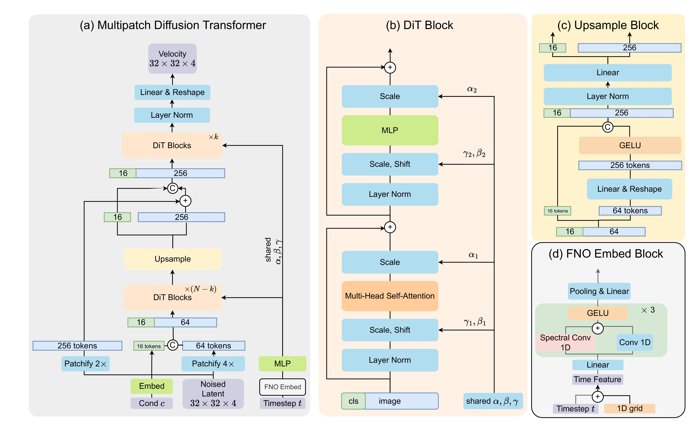

# Official PyTorch Implementation of "MPDiT: Multi-Patch Global-to-Local Transformer Architecture For Efficient Flow Matching and Diffusion Model" [(CVPR 2026)](https://arxiv.org/abs/2603.26357v1)

[Quan Dao](https://quandao10.github.io/) · [Dimitris Metaxas](https://people.cs.rutgers.edu/~dnm/)

[[Paper]](https://arxiv.org/abs/2603.26357v1)



TLDR: MPDiT introduces a global-to-local multi-patch transformer for diffusion and flow matching, reducing GFLOPs by up to 50% while preserving strong generative quality.

## Table of Contents

- [Abstract](#abstract)
- [Installation](#installation)
- [Data](#data)
- [Checkpoints](#checkpoints)
- [Inference](#inference)
- [Evaluation](#evaluation)
- [Training](#training)
- [Repository Structure](#repository-structure)
- [Acknowledgment](#acknowledgment)
- [Citation](#citation)
- [Contacts](#contacts)

## Abstract

Transformer architectures, particularly Diffusion Transformers (DiTs), have become widely used in diffusion and flow-matching models due to their strong performance compared to convolutional UNets. However, the isotropic design of DiTs processes the same number of patchified tokens in every block, leading to relatively heavy computation during training process. In this work, we introduce a multi-patch transformer design in which early blocks operate on larger patches to capture coarse global context, while later blocks use smaller patches to refine local details. This hierarchical design could reduces computational cost by up to 50% in GFLOPs while achieving good generative performance. In addition, we also propose improved designs for time and class embeddings that accelerate training convergence. Extensive experiments on the ImageNet dataset demonstrate the effectiveness of our architectural choices.

## Installation

Tested on Linux with Python 3.10 and CUDA GPUs.

### Option A: Conda YAML

```bash
conda env create -f environment.yml
conda activate DiT
```

### Option B: Setup Script

```bash
bash script/create_env.sh
```

## Data

### 1) Download and Prepare ImageNet (Optional Helper)

```bash
bash script/download_img.sh
```

Expected folder format for training data:

```text
/data/imagenet/train/
  n01440764/
    xxx.JPEG
  n01443537/
    yyy.JPEG
```

### 2) Extract Latent Features

```bash
torchrun --nnodes=1 --nproc_per_node=1 extract_features.py \
  --data-path /path/to/imagenet/train \
  --features-path /path/to/imagenet_feature \
  --image-size 256 \
  --encoder-type vae \
  --vae ema
```

For 512 training, set `--image-size 512`.

### 3) Download Precomputed FID Statistics

```bash
wget https://openaipublic.blob.core.windows.net/diffusion/jul-2021/ref_batches/imagenet/256/VIRTUAL_imagenet256_labeled.npz
wget https://openaipublic.blob.core.windows.net/diffusion/jul-2021/ref_batches/imagenet/512/VIRTUAL_imagenet512.npz
```

## Checkpoints


**Note:** Pretrained model checkpoints will be released soon.


## Inference

### Quick Demo (8 images)

```bash
torchrun --nnodes=1 --nproc_per_node=8 sample.py \
  --model MPDiT-XL/4x \
  --ckpt /path/to/checkpoint.pt \
  --image_size 256 \
  --cfg_scale 1.5 \
  --num_sampling_steps 250 \
  --sample_dir ./samples \
  --time_emb fno \
  --num_condition_tokens 16 \
  --sample_type ode \
  --demo
```

### Full Sampling (50K samples)

```bash
torchrun --master_port=29501 --nnodes=1 --nproc_per_node=8 sample.py \
  --model MPDiT-XL/4x \
  --ckpt /path/to/checkpoint.pt \
  --num_fid_samples 50000 \
  --image_size 256 \
  --cfg_scale 1.5 \
  --num_sampling_steps 250 \
  --sample_dir ./samples \
  --per_proc_batch_size 32 \
  --num_classes 1000 \
  --num_condition_tokens 16 \
  --time_emb fno \
  --sample_type ode
```

For SDE sampling:

```bash
--sample_type sde --diff_form SBDM --diff_norm 1
```

### Qualitative Samples


## Evaluation

Sampling writes metrics to `metrics_cfg*.json`, including:

- Inception Score (IS)
- FID
- sFID
- Precision
- Recall

Standalone evaluation from NPZ files:

```bash
python evaluator.py /path/to/ref_batch.npz /path/to/sample_batch.npz
```

## Training

### Example: MPDiT-XL/4x at ImageNet-256

```bash
accelerate launch --multi_gpu --num_processes 8 --mixed_precision bf16 train.py \
  --model MPDiT-XL/4x \
  --feature_path /path/to/imagenet_feature \
  --exp_name mpdit_xl_256 \
  --results_dir ./results \
  --resolution 256 \
  --epochs 400 \
  --global_batch_size 1024 \
  --ckpt_every 20 \
  --time_sampler lognormal \
  --reweight uniform \
  --lr 2e-4 \
  --loss_type l2 \
  --time_emb fno \
  --num_condition_tokens 16 \
  --num_workers 4 \
  --vae ema
```

To resume training:

```bash
--model_ckpt /path/to/checkpoint.pt
```

You can also start from templates in:

- `script/train.sh`
- `script/sample.sh`
- `script/preprocess.sh`

### Available Models

- `MPDiT-XL/4x`
- `MPDiT-L/4x`
- `MPDiT-B/4x`
- `MPDiTv2-XL`
- `MPDiTv2-L`
- `MPDiTv2-B`

## Repository Structure

- `train.py`: main training script (Accelerate)
- `sample.py`: distributed sampling + metric computation
- `extract_features.py`: VAE latent extraction from ImageFolder data
- `evaluator.py`: IS/FID/sFID/precision/recall utilities
- `otflow.py`: flow matching loss + ODE/SDE samplers
- `models/mpdit.py`: MPDiT and MPDiTv2 architectures
- `script/`: helper scripts for setup, preprocessing, training, and sampling

## Acknowledgment

This codebase builds on ideas and implementations from DiT/ADM and related diffusion-model repositories. We thank the open-source community for making these resources available.

## Citation

If you find this repository useful, please cite:

```bibtex
@article{dao2026mpdit,
  title={MPDiT: Multi-Patch Global-to-Local Transformer Architecture For Efficient Flow Matching and Diffusion Model},
  author={Dao, Quan and Metaxas, Dimitris},
  journal={arXiv preprint arXiv:2603.26357},
  year={2026}
}
```

## Contacts

If you have any problems, please send an email to [kevinquandao10@gmail.com](mailto:kevinquandao10@gmail.com).
